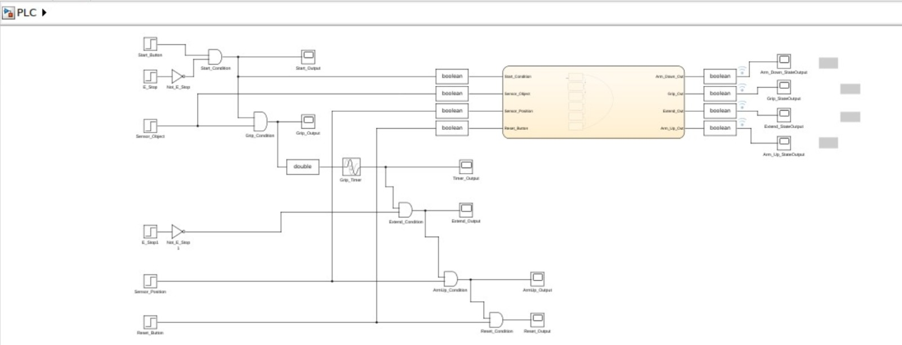
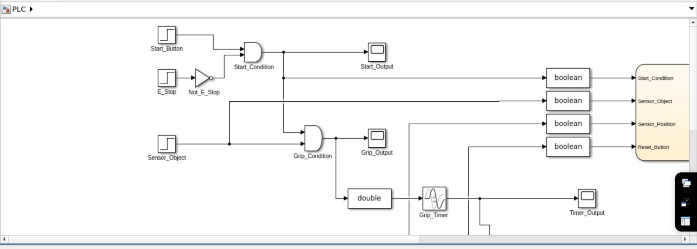
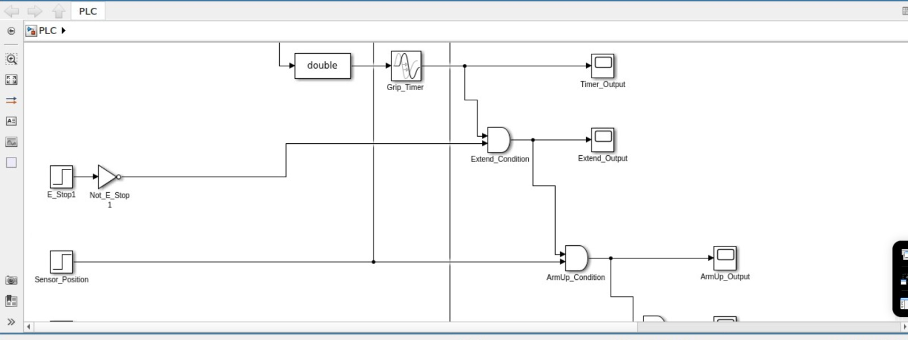
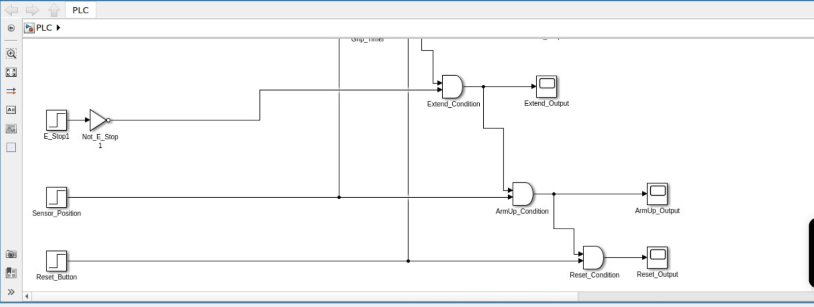
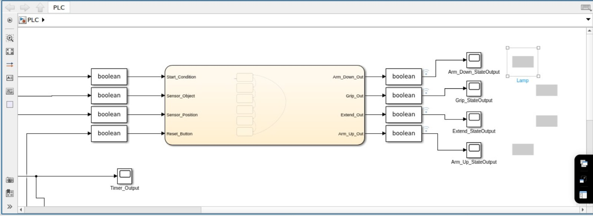

# PLC-Robotic-Arm-Simulink-Stateflow
# 🤖 PLC-Based Robotic Arm Control System

### ⚙️ Simulink + Stateflow | Industrial Automation Logic

---

# 📌 1. Project Overview

This project implements a **PLC-style robotic arm control system** using **MATLAB Simulink and Stateflow**.

The system simulates a **sequential pick-and-place operation**, where each step of the robotic arm is controlled using:

* Digital input signals
* Logical processing (AND / NOT)
* Timer-based delay
* Finite State Machine (FSM)
* Real-time output visualization

---

# 🎯 2. Objective

The objective of this project is to:

* Design a **sequential control system** similar to PLC ladder logic
* Implement **safety using E-Stop logic**
* Use **Stateflow** for step-by-step control
* Integrate **timer-based delay**
* Simulate a **real industrial automation process**

---

# 🧠 3. System Architecture

```text
[Step Inputs] 
      ↓
[Logic Layer (AND / NOT)]
      ↓
[Internal Signals (Conditions)]
      ↓
[Data Type Conversion]
      ↓
[Stateflow Controller]
      ↓
[Output Conversion]
      ↓
 ┌───────────────┬───────────────┐
 ↓               ↓
[Scopes]      [Lamps]
```

---

# 🔌 4. Input Layer (Digital Inputs)

## 🔹 Blocks Used: Step Blocks

### Inputs:

* Start_Button
* E_Stop
* E_Stop1
* Sensor_Object
* Sensor_Position
* Reset_Button

---

## 🔹 Function

Step blocks generate digital signals:


0 → 1 transition at specific time

They simulate:

* Push buttons
* Sensors
* Control switches

---
🔹 PLC Equivalent


Digital Inputs (I0.0, I0.1, etc.)

---

# 🔧 5. Logic Processing Layer

## 🔹 Blocks Used:

* AND blocks
* NOT blocks

---

## 🔹 Logic Implementation

### Start Condition:


Start_Condition = Start_Button AND NOT(E_Stop)


### Grip Condition:


Grip_Condition = Start_Condition AND Sensor_Object


### Extend Condition:


Extend_Condition = Timer_Output AND NOT(E_Stop1)


### Arm Up Condition:


ArmUp_Condition = Extend_Condition AND Sensor_Position


### Reset Condition:


Reset_Condition = ArmUp_Condition AND Reset_Button


---

## 🔹 Purpose

* Combine multiple conditions
* Ensure correct sequence
* Apply safety logic

---

 🔹 PLC Equivalent


Series contacts in ladder logic


NOT block :


Normally Closed (NC) contact


---

# 🔁 6. Internal Signals (Relay Equivalent)


There is **no separate relay block**.

👉 Internal relays are:


Signals (wires carrying logic values)


---

## 🔹 Signals Used

* Start_Condition
* Grip_Condition
* Extend_Condition
* ArmUp_Condition
* Reset_Condition
* Timer_Output

---

## 🔹 Function

* Store intermediate results
* Pass logic forward
* Control next stage

---

🔹 PLC Equivalent


Internal relays (M bits)

---

# 🔄 7. Data Type Conversion

## 🔹 Total Blocks: 9

### Breakdown:

* 4 before Stateflow inputs
* 1 before Timer
* 4 after Stateflow outputs

---

## 🔹 Why Used

Different blocks require different data types:

* Logic → boolean
* Timer → double
* Dashboard → strict boolean

---

 🔹 Example Flow


-> Grip_Condition → Conversion → Timer


-> Condition → Conversion → Stateflow


---

# ⏱ 8. Timer Implementation

## 🔹 Block:

* Grip_Timer

---

## 🔹 Working


Grip_Condition → Timer → Timer_Output


---

## 🔹 Purpose

* Introduce delay between operations
* Prevent instant transitions

---

🔹 PLC Equivalent


TON (Timer ON Delay)


---

# 🎛 9. Stateflow Controller (Core Logic)

## 🔹 Role

Stateflow acts as the **main controller (brain)** of the system.

---

## 🔹 Inputs (Independent)

* Start_Condition
* Sensor_Object
* Sensor_Position
* Reset_Button

---

## 🔹 Important Note


Inputs are parallel — not sequential

-> The Stateflow chart receives multiple independent inputs simultaneously (parallel inputs). The sequential behavior of the system is achieved internally through state transitions, not through the ordering of inputs.

---

## 🔹 Outputs

* Arm_Down_Out
* Grip_Out
* Extend_Out
* Arm_Up_Out

---

## 🔹 States

* Idle
* Arm_Down
* Grip
* Extend
* Arm_Up
* Reset

---

## 🔹 Function

* Controls sequence
* Ensures one state active at a time
* Handles transitions based on conditions

---

 🔹 PLC Equivalent


Sequential Function Chart (SFC)


---

# 📊 10. Monitoring Layer

## 🔹 Scope Blocks

Used for:

* Signal visualization
* Timing analysis

Examples:

* Start_Output
* Grip_Output
* Timer_Output
* Extend_Output
* ArmUp_Output
* Reset_Output


---

# 💡 11. Output Layer

## 🔹 Dashboard Lamps

Used to represent system state:

| Output   | Meaning         |
| -------- | --------------- |
| Arm_Down | Arm moving down |
| Grip     | Gripper active  |
| Extend   | Arm extending   |
| Arm_Up   | Arm lifting     |

---

## 🔹 Color Logic

-> Lamps represent output 
* Green → TRUE
* Red → FALSE

---

# 🔗 12. Complete Signal Flow

```text
Start_Button
   ↓
AND + NOT → Start_Condition
   ↓
AND → Grip_Condition
   ↓
Timer → Timer_Output
   ↓
AND → Extend_Condition
   ↓
AND → ArmUp_Condition
   ↓
AND → Reset_Condition
   ↓
Stateflow → Outputs
```

---

# 📊 13. Block Count Summary

| Block Type           | Count |
| -------------------- | ----- |
| Step Blocks          | 6     |
| AND Blocks           | 5     |
| NOT Blocks           | 2     |
| Timer                | 1     |
| Data Type Conversion | 9     |
| Scope Blocks         | 10    |
| Stateflow            | 1     |
| Lamps                | 4     |

---

# 🖼️ 14. Images

### 🔹 Full Model








### 🔹 Stateflow Diagram


### 🔹 Output


### 🔹 Scope


---

# 🧠 15. Key Concepts Used

* PLC Logic Design
* Sequential Control
* Finite State Machine
* Signal Processing
* Timer-based Automation

---

# 🚀 16. Future Improvements

* Hardware integration (PLC / Arduino)
* Fault detection system
* Real-time control interface
* Robotic animation

---

# 🏁 17. Conclusion

This project successfully demonstrates how **PLC ladder logic concepts can be implemented using Simulink and Stateflow**, combining:

* Logic processing
* Timing control
* Sequential automation
* Real-time visualization

---

# 👨‍💻 Author

**Vatsalkumar Chauhan**
B.Tech Automation & Robotics

---

